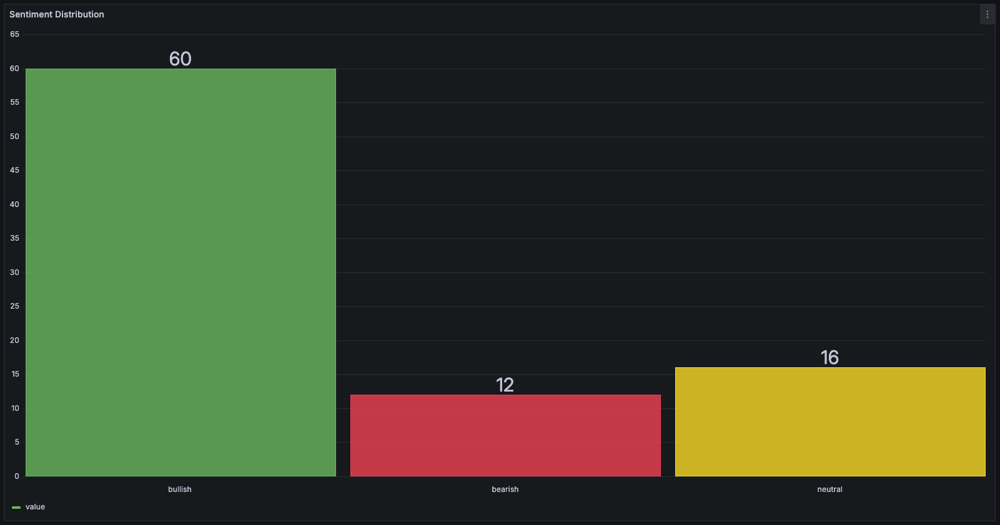
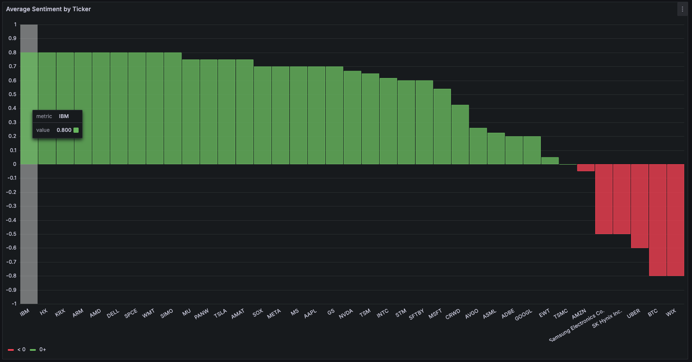

# News Sentiment & Market Intelligence Pipeline

A distributed, AI-powered data pipeline that ingests US financial news in real time, scores each article with a Large Language Model (sentiment + entity extraction), persists the structured results, and visualizes market sentiment on a live dashboard.

Built around a streaming architecture (Kafka + Spark) with LLM-based enrichment, the system turns unstructured financial news into queryable, structured market-sentiment data — using **TSMC (TSM)** and the broader semiconductor sector as the primary tracking target.

---

## Why this project

Investors and analysts face information overload: hundreds of financial news articles per day, far more than anyone can read. This pipeline answers a focused question:

> **How is news sentiment trending for a given stock, in real time?**

For each article it produces a structured record — bullish / bearish / neutral, a numeric sentiment score, the tickers mentioned, and a one-line AI summary — and aggregates these into per-ticker sentiment analytics.

---

## Architecture

```
  ┌─────────────┐     ┌─────────┐     ┌──────────────────┐     ┌─────────┐     ┌────────────┐     ┌──────────┐
  │ CNBC RSS  + │────▶│  Kafka  │────▶│  Scoring Service │────▶│  Kafka  │────▶│ PostgreSQL │────▶│ Grafana  │
  │ Finnhub API │     │raw-news │     │  (Groq / Gemini) │     │ scored- │     │ (storage + │     │(dashboard)│
  └─────────────┘     └─────────┘     └──────────────────┘     │  news   │     │  analytics)│     └──────────┘
       ingest          buffer          sentiment + NER         └─────────┘       SQL queries        visualize
                                                                                                
                          ▲
                          │
                  ┌───────────────┐
                  │ Spark Struct. │   (parallel stream processing / parsing layer)
                  │  Streaming    │
                  └───────────────┘
```

Every component runs as a Docker container. The infrastructure can be provisioned three ways: **Docker Compose** (standard local dev), **Kubernetes / minikube** (the scoring service + in-cluster Kafka), and **Terraform** (declarative IaC for the Docker stack).

---

## Tech Stack

| Layer | Technology |
|-------|------------|
| **Ingestion** | Python, `feedparser` (CNBC RSS), Finnhub API |
| **Message broker** | Apache Kafka (Confluent image, **KRaft mode** — no ZooKeeper) |
| **Stream processing** | PySpark Structured Streaming |
| **AI enrichment** | Groq (Llama 3.3 70B) primary, Google Gemini (2.5 Flash) secondary — provider-agnostic, switchable via `LLM_PROVIDER` (extensible to OpenAI / Claude) |
| **Storage** | PostgreSQL 16 |
| **Visualization** | Grafana |
| **Infrastructure** | Docker, Docker Compose |
| **Infrastructure as Code** | Terraform (kreuzwerker/docker provider — declarative provisioning of the full infra stack) |
| **Orchestration** | Kubernetes (minikube), with in-cluster Kafka + deployed scoring service |
| **Monitoring** | Kafdrop (Kafka UI) |

---

## Key Engineering Decisions

- **Decoupled streaming architecture** — producers and consumers communicate only through Kafka topics (`raw-news`, `scored-news`). Each stage can fail or scale independently without losing data.
- **KRaft-mode Kafka** — uses the modern ZooKeeper-less Kafka, with a dual-listener setup (host + internal Docker network) so both local scripts and containers can connect.
- **Provider-agnostic LLM layer** — sentiment scoring is decoupled from any single LLM vendor. The active provider is chosen by the `LLM_PROVIDER` env var, so switching backends (Groq ↔ Gemini) requires no change to the prompt, retry, or fallback logic. When Gemini's free-tier quota was cut, the pipeline switched to Groq with a single env var.
- **Structured LLM output** — the LLM is prompted to return strict JSON, converting unstructured text into a fixed schema suitable for analytics.
- **Graceful degradation & rate limiting** — the scoring service wraps LLM calls in retry logic with exponential backoff and falls back to a safe default on persistent failure; it also throttles requests client-side to respect the provider's free-tier rate limits and avoid `429` errors.
- **Stateful vs stateless services** — PostgreSQL and Grafana use named Docker volumes for persistence; stateless processing services can be recreated freely.
- **Parameterized SQL inserts** — prevents SQL injection and keeps the storage layer safe.
- **Infrastructure as Code** — the entire Docker infrastructure (network, broker, database, dashboard) is declared in Terraform, so the full stack provisions reproducibly with a single `terraform apply` and tears down cleanly with `terraform destroy`. State and lock files are gitignored to keep credentials out of version control.

---

## Pipeline Stages

1. **Ingestion** — fetches financial news from CNBC RSS feeds and ticker-tagged news from the Finnhub API.
2. **Buffering** — articles are published to the Kafka `raw-news` topic, decoupling ingestion from processing.
3. **Stream processing** — a Spark Structured Streaming job consumes `raw-news`, parses the JSON, and structures the data into typed columns.
4. **AI scoring** — a scoring service reads each article, sends it to the LLM for sentiment + ticker extraction, and publishes enriched records to `scored-news`.
5. **Storage** — a database writer consumes `scored-news` and persists records into PostgreSQL with indexes for fast analytical queries.
6. **Visualization** — Grafana connects to PostgreSQL and renders live dashboards (sentiment distribution, average sentiment per ticker).

---

## Dashboard

The Grafana dashboard turns the scored news into live market-sentiment analytics.

### Sentiment Distribution
Count of bullish / bearish / neutral articles across the latest news batch.



### Average Sentiment by Ticker
Mean sentiment score per stock, computed by splitting and unnesting the comma-separated ticker field in SQL. Green bars indicate net-positive sentiment, red bars net-negative.



---

## Getting Started

### Prerequisites
- Docker & Docker Compose
- Python 3.12
- A Finnhub API key (free tier), plus a Groq API key (primary) and/or a Google Gemini API key (secondary) — all free tier

### Setup

```bash
# 1. Clone and enter the project
git clone https://github.com/GuanHongLin1120/news-sentiment-pipeline.git
cd news-sentiment-pipeline

# 2. Create a virtual environment and install dependencies
python3 -m venv venv
source venv/bin/activate
pip install -r requirements.txt

# 3. Add API keys: copy the template and fill in your own keys
cp .env.example .env
# then edit .env and set FINNHUB_API_KEY, GROQ_API_KEY, (optionally GEMINI_API_KEY)

# 4. Start the infrastructure (Kafka, Kafdrop, PostgreSQL, Grafana)
docker compose up -d

# 5. Create the database schema
docker exec -i postgres psql -U newsuser -d newsdb < spark_processor/schema.sql
```

### Running the pipeline

```bash
# Ingest news into Kafka
python3 kafka_producer/producer.py

# Score articles with the LLM and publish to scored-news (uses Groq by default;
# switch with: LLM_PROVIDER=gemini python3 spark_processor/scoring_service.py)
python3 spark_processor/scoring_service.py

# Persist scored articles into PostgreSQL
python3 spark_processor/db_writer.py
```

### Access points

| Service | URL |
|---------|-----|
| Grafana dashboard | http://localhost:3000 |
| Kafdrop (Kafka UI) | http://localhost:9000 |
| PostgreSQL | localhost:5432 |

---

## Project Structure

```
news-sentiment-pipeline/
├── scraper/                 # Data ingestion (CNBC RSS, Finnhub API)
│   ├── cnbc_scraper.py
│   └── finnhub_scraper.py
├── kafka_producer/          # Kafka producer & consumer
│   ├── producer.py
│   └── consumer.py
├── spark_processor/         # Processing, LLM scoring, storage
│   ├── stream_processor.py  # Spark Structured Streaming
│   ├── llm_analyzer.py      # Provider-agnostic LLM scoring (Groq / Gemini)
│   ├── scoring_service.py   # Kafka → LLM → Kafka (long-running, rate-limited)
│   ├── db_writer.py         # Kafka → PostgreSQL
│   └── schema.sql           # Database schema
├── k8s/                     # Kubernetes manifests (in-cluster Kafka + scoring service)
├── terraform/               # Terraform IaC (Docker provider)
├── images/                  # Dashboard screenshots
├── Dockerfile               # Builds the scoring-service image
├── docker-compose.yml       # All services
├── .env.example             # Template for API keys
└── requirements.txt
```

---

## Roadmap

- [ ] Multi-LLM ensemble (Groq + Gemini + OpenAI) with inter-model agreement as a confidence signal
- [ ] Scheduled / automated ingestion for continuous data flow
- [ ] Cassandra integration for high-throughput time-series storage
- [x] Kubernetes deployment (in-cluster Kafka + containerized scoring service, Secret-managed credentials)
- [x] Terraform-managed infrastructure (declarative IaC for Docker network + Kafka/Kafdrop/Postgres/Grafana, with outputs)
- [ ] Correlation analysis: news sentiment vs. stock price movement

---

## License

MIT